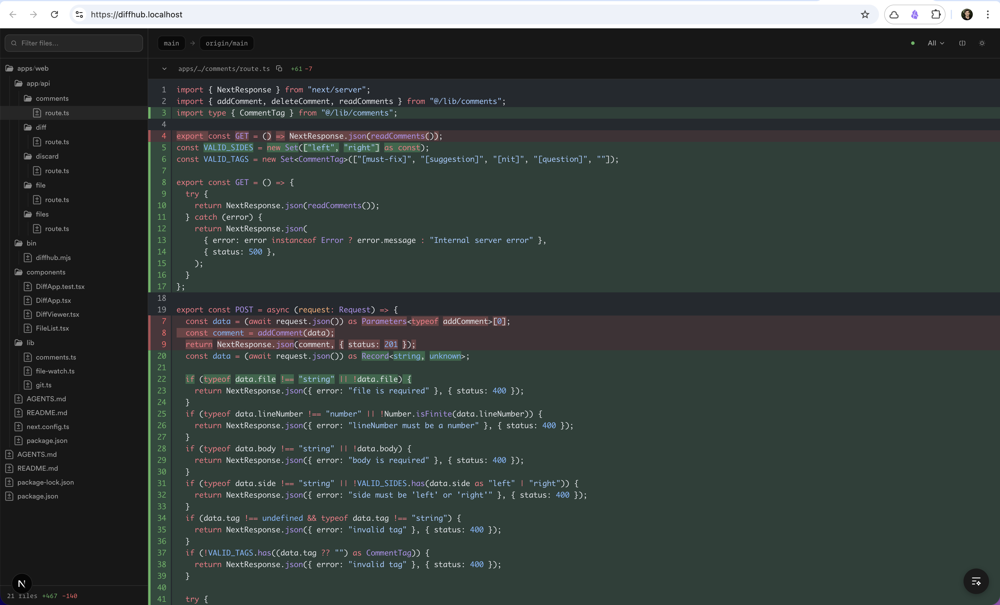

<div align="center">

# [DiffHub](https://blode.co/diffhub)

**Review your git branch in a [cmux](https://cmux.com) browser split, with inline comments you can hand to an agent**

Run one command inside any git repository and DiffHub serves a GitHub-style diff of your branch at `localhost:2047`.

<p align="center">
  <a href="https://www.npmjs.com/package/diffhub">
    
  </a>
  <a href="https://github.com/mblode/diffhub/blob/main/LICENSE.md">
    
  </a>
</p>

</div>

## Demo

Browse any public GitHub pull request in the hosted viewer, with nothing installed.

<p>
<a href="https://blode.co/diffhub/oven-sh/bun/pull/16000">

</a>
</p>



## Install

```bash
npm install -g diffhub
```

Or run it without installing: `npx diffhub@latest`.

## Quickstart

Run inside any git repository.

```bash
# Review the current branch in a cmux browser split
diffhub cmux

# The same viewer in your default browser
diffhub

# Compare against a different base branch
diffhub cmux --base develop

# Review a repository in another directory
diffhub cmux --repo ~/Code/mblode/cmux
```

DiffHub diffs your branch against the merge-base with the detected base branch, preferring `origin/main` so unpushed commits still show up. It watches the repository and refreshes as you work.

## Commands

| Command         | Description                                 |
| --------------- | ------------------------------------------- |
| `diffhub`       | Open DiffHub in your default browser        |
| `diffhub cmux`  | Open DiffHub in a cmux browser split        |
| `diffhub serve` | Same as `diffhub`, starts the local web app |

## Options

### `diffhub` and `diffhub serve`

| Flag                  | Default | Description                 |
| --------------------- | ------- | --------------------------- |
| `-p, --port <port>`   | `2047`  | Port to serve on            |
| `-r, --repo <path>`   | `cwd`   | Path to the git repository  |
| `-b, --base <branch>` | auto    | Base branch to diff against |
| `--no-open`           |         | Skip automatic browser open |

### `diffhub cmux`

| Flag                  | Default | Description                 |
| --------------------- | ------- | --------------------------- |
| `-r, --repo <path>`   | `cwd`   | Path to the git repository  |
| `-b, --base <branch>` | auto    | Base branch to diff against |

## Keyboard shortcuts

| Key       | Action                            |
| --------- | --------------------------------- |
| `j` / `k` | Next / previous file              |
| `s`       | Toggle split / stacked view       |
| `c`       | Collapse or expand the whole file |
| `/`       | Focus the file filter             |
| `r`       | Refresh the diff                  |

## Notes

- Node.js 20.11+ or Bun 1.0.23+, and a git repository with at least one commit on the current branch.
- cmux mode expects `cmux.app` installed on macOS at `/Applications/cmux.app`.
- Comments live in `.git/diffhub-comments.json` in the repository you are reviewing, and copy out as a markdown review prompt for a coding agent.

## License

MIT

---

Crafted by [](https://blode.co) [Matthew Blode](https://blode.co)
